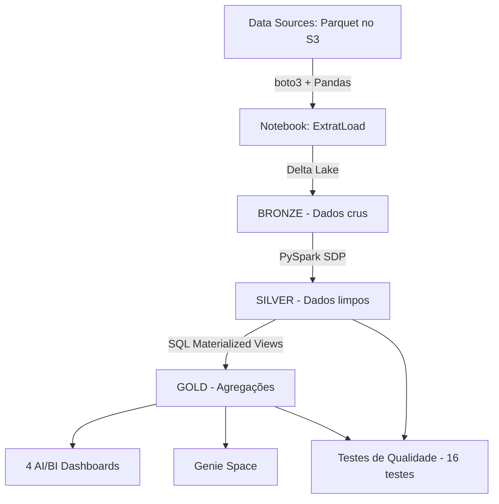

# E-commerce Lakehouse — Data Engineering Pipeline

Pipeline de Data Engineering para e-commerce construído no Databricks com arquitetura Medallion (Bronze → Silver → Gold). O projeto cobre desde a ingestão de ficheiros Parquet armazenados no S3 até dashboards analíticos para três diretorias: Comercial, Customer Success e Pricing.

## Overview

Este projeto implementa um Lakehouse completo para análise de vendas e competitividade de preços de uma operação de e-commerce brasileira. Os dados são ingeridos de ficheiros Parquet armazenados num bucket S3, processados através de um pipeline Spark Declarativo (SDP) com qualidade de dados garantida por expectations e testes automatizados, e disponibilizados em 8 tabelas Gold que alimentam 4 dashboards AI/BI e um Genie Space para consultas em linguagem natural.

## Business / Data Problem

Uma operação de e-commerce precisa responder a três perguntas de negócio distintas:

* **Diretoria Comercial**: Quanto vendemos, quando e em qual canal? Quais produtos geram mais receita?
* **Diretoria de Customer Success**: Quem são os melhores clientes? Como segmentar a carteira para priorizar o atendimento?
* **Diretoria de Pricing**: Somos mais caros que a concorrência? Em quais produtos precisamos ajustar preços?

O projeto resolve estes problemas com uma arquitetura Lakehouse que transforma dados crus em tabelas analíticas prontas para consumo, com qualidade de dados garantida em cada etapa.

## Objectives

* Ingerir 4 datasets (clientes, vendas, produtos, preços de concorrentes) de ficheiros Parquet no S3
* Limpar e enriquecer os dados na camada Silver com regras de negócio e quality gates
* Criar agregações e métricas na camada Gold para 3 diretorias
* Garantir a qualidade dos dados com 16 testes automatizados
* Disponibilizar os resultados em 4 dashboards AI/BI interativos
* Permitir consultas em linguagem natural via Genie Space

## Architecture

O projeto segue a arquitetura Medallion do Databricks Lakehouse:



### Medallion Architecture

#### Bronze

Dados na sua forma original, ingeridos a partir de ficheiros Parquet no S3. O notebook `ExtratLoad` lê os ficheiros com `boto3` + `pandas`, converte para Spark DataFrames e escreve como tabelas Delta no catálogo `ecommerce.bronze`.

| Tabela | Origem (S3) | Colunas |
| --- | --- | --- |
| `ecommerce.bronze.clientes` | `clientes.parquet` | id_cliente, nome_cliente, estado, pais, data_cadastro |
| `ecommerce.bronze.vendas` | `vendas.parquet` | id_venda, data_venda, id_cliente, id_produto, canal_venda, quantidade, preco_unitario |
| `ecommerce.bronze.produtos` | `produtos.parquet` | id_produto, nome_produto, categoria, marca, preco_atual, data_criacao |
| `ecommerce.bronze.preco_competidores` | `preco_competidores.parquet` | id_produto, nome_concorrente, preco_concorrente, data_coleta |

**Características:**
* Ingestão via notebook Python com `boto3` (cliente S3)
* Leitura de Parquet com `pandas`
* Escrita como tabelas Delta Lake (formato transacional)
* Modo `overwrite` — cada ingestão substitui os dados anteriores

#### Silver

Limpeza, tipagem, deduplicação e enriquecimento. Implementada como materialized views de um Lakeflow Spark Declarative Pipeline (SDP) serverless, em Python/PySpark.

| Tabela | Transformações Principais |
| --- | --- |
| `silver.vendas` | Dedup por id_venda, DECIMAL(10,2), receita = quantidade × preco_unitario, flag de outliers (média + 3σ), join com produtos (produto_cadastrado, venda_antes_do_cadastro), decomposição temporal (data, hora, dia_semana) |
| `silver.produtos` | Dedup por id_produto, TRIM nome, DECIMAL(10,2), classificação faixa_preco (PREMIUM >1000, MEDIO >500, BASICO) |
| `silver.clientes` | Dedup por id_cliente, remove pronomes de tratamento (Sr., Sra., Dr.), initcap, UF em maiúsculas, mapeamento IBGE das 27 UFs para nome_estado e região |
| `silver.preco_competidores` | Dedup por id_produto + nome_concorrente, DECIMAL(10,2), flag preco_suspeito (<60% do nosso preço) |

**Quality Gates (SDP Expectations):**
* `expect_all_or_fail`: campos obrigatórios preenchidos, valores positivos, canal_venda válido
* `expect` (warn): produto_cadastrado, venda_depois_do_cadastro, preco_dentro_intervalo — problemas conhecidos são marcados, não descartados (mudariam a receita)

#### Gold

Agregações e métricas finais para análise. Implementadas como SQL materialized views no mesmo pipeline SDP.

| Tabela | Diretoria | Descrição |
| --- | --- | --- |
| `gold.clientes_segmentacao` | Customer Success | Segmentação VIP (≥R$22k) / TOP_TIER (R$17k-22k) / REGULAR (<R$17k), ranking de receita, inclui clientes sem compras |
| `gold.vendas_detalhadas` | Comercial | Uma linha por venda com todas as dimensões (temporal, produto, cliente, segmento). CLUSTER BY (data) |
| `gold.vendas_diarias` | Comercial | Agregação diária por canal com receita suspeita |
| `gold.vendas_por_produto` | Comercial | Vendas por produto com LEFT JOIN (inclui produtos sem venda) |
| `gold.vendas_por_cliente` | Comercial | Resumo de compras por cliente com localização |
| `gold.vendas_produtos` | Comercial | Análise por produto com ranking geral e por categoria, inclui produtos não cadastrados |
| `gold.vendas_temporais` | Comercial | Agregação por data × hora × canal_venda |
| `gold.precos_competitividade` | Pricing | Compara nosso preço vs concorrentes (Mercado Livre, Amazon, Magalu, Shopee), classifica e calcula diferenças percentuais |

### Data Flow

```
Data Sources (Parquet no S3)
        │
        ▼
  Notebook ExtratLoad (boto3 + Pandas + PySpark)
        │
        ▼
    ┌─────────┐
    │ BRONZE  │  4 tabelas Delta (dados crus)
    └────┬────┘
         │
         ▼
    ┌─────────┐
    │ SILVER  │  4 materialized views PySpark (limpeza + enriquecimento)
    └────┬────┘
         │
         ▼
    ┌─────────┐
    │  GOLD   │  8 materialized views SQL (agregações + métricas)
    └────┬────┘
         │
         ▼
    ANALYTICS (4 Dashboards AI/BI + Genie Space)
```

## ELT Pipeline

O processo ELT (Extract, Load, Transform) é executado em duas etapas:

### 1. Extract + Load (Notebook ExtratLoad)

| Etapa | Tecnologia | Descrição |
| --- | --- | --- |
| Extração | boto3 | Download de ficheiros Parquet do bucket S3 |
| Leitura | Pandas | `pd.read_parquet()` para DataFrame pandas |
| Conversão | PySpark | `spark.createDataFrame()` converte para Spark |
| Carga | Delta Lake | `.saveAsTable("ecommerce.bronze.*")` em formato Delta |

### 2. Transform (Pipeline SDP)

| Etapa | Tecnologia | Descrição |
| --- | --- | --- |
| Silver | PySpark SDP | 4 materialized views com limpeza, dedup, tipagem, enriquecimento |
| Gold | SQL SDP | 8 materialized views com agregações, joins, rankings, regras de negócio |
| Qualidade | Python | 16 testes automatizados validam chaves, receita, segmentos e consistência |

## AWS Integration

### S3 Storage

Os dados de origem são ficheiros Parquet armazenados num bucket S3 compatível (Supabase S3-compatible Storage):

* **Bucket**: `DataLakeEcommerce`
* **Região**: `eu-central-1`
* **Ficheiros**: `clientes.parquet`, `vendas.parquet`, `produtos.parquet`, `preco_competidores.parquet`
* **Acesso**: via `boto3.client('s3')` com credenciais de ambiente (ver `.env.example`)

### boto3

O cliente `boto3` é utilizado para:
* `s3.list_buckets()` — validar acesso
* `s3.get_object()` — download de ficheiros Parquet

### Parquet

Formato colunar de armazenamento dos dados de origem. Lido com `pandas.read_parquet()` a partir do `BytesIO` do corpo da resposta S3.

### Relação S3 ↔ Databricks

```
S3 (Parquet) → boto3 → Pandas → PySpark → Delta Lake (Bronze)
```

O Databricks não acessa o S3 diretamente como storage externo. A leitura é feita via `boto3` no notebook, e os dados são materializados como tabelas Delta no catálogo Unity Catalog.

## Data Processing

### Python (Ingestão)

O notebook `ExtratLoad` usa Python para orquestrar a ingestão: `boto3` para S3, `pandas` para leitura de Parquet, e conversão para Spark DataFrames.

### PySpark (Silver)

As transformações Silver são materialized views de um Lakeflow Spark Declarative Pipeline:
* `from pyspark import pipelines as dp` — decorador `@dp.materialized_view()`
* `from pyspark.sql import functions as F` — transformações
* `@dp.expect_all_or_fail(...)` — quality gates obrigatórios
* `@dp.expect(...)` — quality gates de aviso (warn)

### SQL (Gold)

As transformações Gold são `CREATE OR REFRESH MATERIALIZED VIEW` em SQL, executadas no mesmo pipeline SDP. Todas incluem:
* Comentários em cada coluna (para alimentar o Genie Space)
* `CLUSTER BY` otimizado para padrões de consulta
* `CAST` explícito em todas as colunas para garantir tipos

## Data Model

### Tabelas Silver (4)

| Tabela | Chave Primária | Joins |
| --- | --- | --- |
| `silver.vendas` | id_venda | → silver.produtos (id_produto) |
| `silver.produtos` | id_produto | — |
| `silver.clientes` | id_cliente | — |
| `silver.preco_competidores` | (id_produto, nome_concorrente) | → silver.produtos (id_produto) |

### Tabelas Gold (8)

| Tabela | Chave | Joins |
| --- | --- | --- |
| `gold.clientes_segmentacao` | id_cliente | silver.clientes ⟕ silver.vendas |
| `gold.vendas_detalhadas` | id_venda | silver.vendas ⟕ silver.produtos ⟕ silver.clientes ⟕ gold.clientes_segmentacao |
| `gold.vendas_diarias` | (data, canal_venda) | silver.vendas |
| `gold.vendas_por_produto` | id_produto | silver.produtos ⟕ silver.vendas |
| `gold.vendas_por_cliente` | id_cliente | silver.clientes ⟕ silver.vendas |
| `gold.vendas_produtos` | id_produto | silver.vendas ⟕ silver.produtos |
| `gold.vendas_temporais` | (data, hora, canal_venda) | silver.vendas |
| `gold.precos_competitividade` | id_produto | silver.produtos ⋈ silver.preco_competidores ⟕ silver.vendas |

## Data Quality

### Análise de Qualidade Bronze

O notebook de análise de qualidade identificou na tabela `bronze.vendas` (3.020 registros, período 13/12/2025 a 11/01/2026):

| Verificação | Resultado |
| --- | --- |
| Valores nulos (todas as colunas) | 0 |
| Duplicatas em id_venda | 0 |
| quantidade ≤ 0 | 0 |
| preco_unitario ≤ 0 | 0 |
| Strings vazias | 0 |
| Espaços leading/trailing | 0 |
| Datas no futuro | 0 |
| Outliers em preco_unitario (acima de 3σ) | 163 registros |
| Produtos com múltiplos preços | 179 de 205 (87%) |
| Canais de venda | ecommerce (2.155), loja_fisica (865) |

### Expectations do Pipeline (Silver)

| Camada | Tipo | Regras |
| --- | --- | --- |
| silver.vendas | fail | id_venda, data_venda, id_cliente, id_produto, quantidade, preco_unitario preenchidos; quantidade > 0; preco_unitario > 0; canal_venda IN ('ecommerce', 'loja_fisica') |
| silver.vendas | warn | produto_cadastrado, venda_depois_do_cadastro, preco_dentro_intervalo |
| silver.produtos | fail | id_produto preenchido, preco_atual > 0 |
| silver.clientes | fail | id_cliente preenchido, regiao preenchida |
| silver.preco_competidores | fail | id_produto preenchido, preco_concorrente > 0 |
| silver.preco_competidores | warn | preco_plausivel (NOT preco_suspeito) |

### Testes Automatizados (16 testes)

O ficheiro `testes/testes_qualidade.py` executa 16 testes após o pipeline:

| Teste | Descrição |
| --- | --- |
| 1a-1d | Chaves únicas nas 4 tabelas Silver |
| 2 | receita = quantidade × preco_unitario |
| 3 | Vendas de produto não cadastrado < 1% |
| G1 | Receita total gold.clientes_segmentacao = silver.vendas |
| G2 | id_cliente único em gold.clientes_segmentacao |
| G3 | segmento_cliente ∈ {VIP, TOP_TIER, REGULAR} |
| G4 | Nenhum VIP com receita < R$ 22.000 |
| G5 | Toda coluna Gold com comentário |
| G6 | Receita total gold.vendas_temporais = silver.vendas |
| G7 | Receita total gold.vendas_produtos = silver.vendas |
| G8 | Receita total gold.vendas_detalhadas = silver.vendas |
| G9 | vendas_detalhadas com mesmo número de linhas que silver.vendas |
| G10 | id_venda único em gold.vendas_detalhadas |
| G11 | vendas_detalhadas com segmento e região preenchidos |
| G12 | id_produto único em gold.precos_competitividade |

## Jobs & Automation

### Pipeline SDP

Lakeflow Spark Declarative Pipeline serverless:
* **Catálogo**: ecommerce
* **Schema**: silver
* **Serverless**: true
* **Photon**: true
* **Channel**: CURRENT
* **Bibliotecas**: 4 ficheiros Python (Silver) + 4 ficheiros SQL (Gold)

### Job "Pipeline E-commerce"

Declarative Automation Bundle (DAB) que orquestra:
1. **Task 1**: Executa o pipeline SDP
2. **Task 2**: Executa os testes de qualidade (depende do pipeline)
* **Cluster**: i3.xlarge, 1 worker, Spark 15.4.x

### Dashboards Bundle

DAB separado para deploy dos 4 dashboards AI/BI:
* Targets: dev e prod
* Warehouse: Serverless Starter Warehouse
* 4 dashboards exportados via Lakeview API

## Results

### Diretoria de Customer Success
* 50 clientes segmentados: 10 VIP, 25 TOP_TIER, 15 REGULAR
* Receita total: R$ 974.077,28
* Top cliente: Ana Sophia Pereira (MG, R$ 30.716,63)

### Diretoria Comercial
* `vendas_temporais`: 908 linhas (agregação data × hora × canal)
* `vendas_produtos`: 205 produtos com ranking de receita
* `vendas_detalhadas`: 3.020 vendas detalhadas com todas as dimensões

### Diretoria de Pricing
* 215 produtos monitorados
* 35 produtos MAIS_CARO_QUE_TODOS os concorrentes
* 15 produtos com preço suspeito
* Classificações: ACIMA_DA_MEDIA=92, ABAIXO_DA_MEDIA=76, NA_MEDIA=6, MAIS_BARATO_QUE_TODOS=6

### Dashboards
* 4 dashboards AI/BI publicados (Visão Executiva, Comercial, Customer Success, Pricing)
* Genie Space para consultas em linguagem natural

## Project Structure

```
ecommerce-lakehouse/
│
├── README.md
├── .gitignore
├── .env.example
├── requirements.txt
│
├── architecture/
│   ├── architecture-diagram.md
│   └── data-lineage.md
│
├── notebooks/
│   └── ingestion/
│       └── extratload.py          # Ingestão Bronze (credenciais via env vars)
│
├── src/
│   └── pipeline/
│       ├── databricks.yml          # DAB bundle do pipeline
│       ├── CLAUDE.md               # Convenções do projeto
│       ├── resources/
│       │   ├── pipeline.yml        # Definição do pipeline SDP
│       │   └── job.yml             # Job: pipeline + testes
│       ├── transformations/
│       │   ├── silver/              # PySpark materialized views
│       │   │   ├── vendas.py
│       │   │   ├── produtos.py
│       │   │   ├── clientes.py
│       │   │   └── preco_competidores.py
│       │   └── gold/               # SQL materialized views
│       │       ├── clientes_segmentacao.sql
│       │       ├── vendas_detalhadas.sql
│       │       ├── vendas_diarias.sql
│       │       ├── vendas_por_produto.sql
│       │       ├── vendas_por_cliente.sql
│       │       ├── vendas_produtos.sql
│       │       ├── vendas_temporais.sql
│       │       └── precos_competitividade.sql
│       └── testes/
│           └── testes_qualidade.py
│
├── dashboards/
│   ├── databricks.yml              # DAB bundle dos dashboards
│   ├── README.md
│   ├── DEPLOY_GUIDE.md
│   └── src/
│       └── dashboards/
│           ├── vendas_ecommerce.lvdash.json
│           ├── diretoria_comercial.lvdash.json
│           ├── diretoria_customer_success.lvdash.json
│           └── diretoria_pricing.lvdash.json
│
├── data/
│   └── README.md                   # Descrição dos dados (não publicar Parquet)
│
└── docs/
    └── data-quality.md             # Análise de qualidade Bronze
```

## Technologies

| Tecnologia | Utilização |
| --- | --- |
| Databricks | Lakehouse, SDP, AI/BI Dashboards, Genie, Jobs |
| Python | Ingestão (boto3), automação (SDK), testes de qualidade |
| PySpark | Transformações da camada Silver (SDP materialized views) |
| SQL | Camada Gold (materialized views) e consultas analíticas |
| Pandas | Leitura de Parquet do S3 |
| boto3 | Cliente S3 para download de ficheiros |
| AWS S3 (Supabase) | Storage de ficheiros Parquet de origem |
| Parquet | Formato dos ficheiros de origem |
| Delta Lake | Tabelas transacionais na camada Bronze |
| DAB | Deploy do pipeline e dos dashboards |
| Databricks SDK | Export de dashboards via Lakeview API |

## Security

### Credenciais

Este projeto utiliza **variáveis de ambiente** para todas as credenciais. Nunca hardcode credenciais no código.

* Ver `.env.example` para as variáveis necessárias
* O ficheiro `.env` está no `.gitignore` e nunca deve ser commitado
* No Databricks, usar **Databricks Secrets** (`dbutils.secrets.get()`) ou **Service Principal + IAM**

### O que NUNCA publicar no GitHub

* AWS Access Key / Secret Key
* Passwords e tokens
* Connection strings privadas
* Credenciais Databricks
* Dados pessoais de clientes
* URLs privadas de endpoints

## Future Improvements

* **Streaming ingestion**: Substituir o notebook batch por Auto Loader para ingestão contínua
* **Incremental refresh**: Materialized views com refresh incremental em vez de overwrite
* **Data catalog**: Publicar tabelas Gold como metric views para reuso em múltiplos dashboards
* **Alerting**: Configurar alertas automáticos para falhas nos testes de qualidade
* **CI/CD**: Pipeline GitOps com validação automática do bundle antes do deploy
* **Row-level security**: Implementar RLS na camada Gold por diretoria

> Estas são melhorias futuras sugeridas, não funcionalidades já implementadas.

## Conclusion

Este projeto demonstra um pipeline de Data Engineering completo no Databricks Lakehouse, desde a ingestão de dados Parquet do S3 até dashboards analíticos para três diretorias. A arquitetura Medallion garante separação de responsabilidades, a qualidade de dados é assegurada por expectations e 16 testes automatizados, e a orquestração é feita via Declarative Automation Bundles (DAB). O resultado é um Lakehouse production-ready que permite tanto análise visual quanto consultas em linguagem natural.

## Author

**Helmer Capassola**

Data Engineer

---

*Projeto de Data Engineering | Databricks Lakehouse | Arquitetura Medallion*
