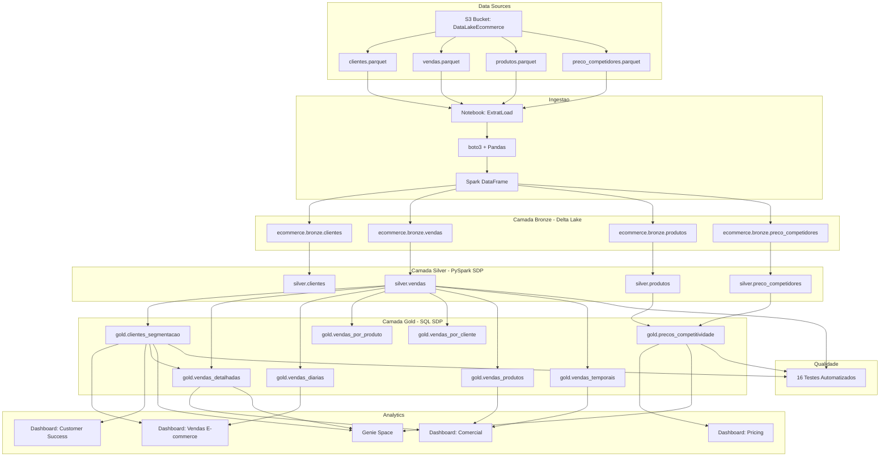

# Architecture Diagram

## Visao Geral

O projeto segue a arquitetura Medallion do Databricks Lakehouse, com 4 camadas: Source -> Bronze -> Silver -> Gold -> Analytics.

## Diagrama

## Componentes

| Componente | Tecnologia | Descricao |
| --- | --- | --- |
| Source | S3 (Supabase) | 4 ficheiros Parquet no bucket DataLakeEcommerce |
| Ingestion | Python + boto3 + Pandas | Notebook le Parquet do S3, converte para Spark, escreve Delta |
| Bronze | Delta Lake | 4 tabelas no catalogo ecommerce.bronze |
| Silver | PySpark SDP | 4 materialized views com limpeza e enriquecimento |
| Gold | SQL SDP | 8 materialized views com agregacoes e metricas |
| Analytics | AI/BI Dashboards + Genie | 4 dashboards + Genie Space |
| Quality | Python | 16 testes automatizados pos-pipeline |
| Orquestracao | DAB | Job: pipeline + testes |
